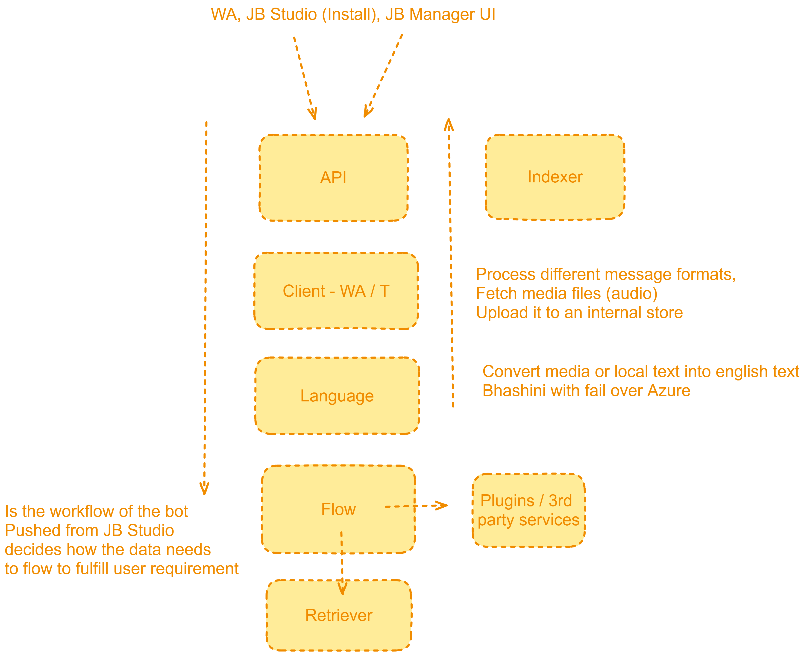

# Deep Dive

This document explains the inner workings of the JB Manager. It also provides the gaps in the current implementation.

## Architecture

All the services are generic i.e. they are designed for multiple bots or use cases. The only customization that exists lies in the tiny bot code (finite state machine code) which is published by the Studio.

Language Flow

## DB Structure

**Bot**

bot_id (e.g. "12345") is at the highest level. All other entries like person, sessions are against a particular bot. We support multiple bots from the same backend.

**User**

A user needs to be registered for the bot. Phone Number & Bot ID make the user unique.

**Session**

We maintain session for 24 hours. After that a fresh conversation starts.

**Turn**

Every message received from the user creates a new turn in the conversation. Against one user message, we can have multiple bot responses.

**Message**

Every message received or sent is logged to the DB.

**FSM State**

This table currently stores the state (stage in the workflow) and variables. This needs to be merged with session table.

## Services

### API

Provides APIs to interact with JB Manager. Here are the top buckets of APIs:
1. Callback from channels like WhatsApp or Telegram
2. JB Studio like publishing the bot
3. Managing bots changing their states and variables
4. Viewing chat logs and analytics
5. Triggering indexing jobs

**Callback**

1. Figure out `bot_id` based on the callback
2. Create person if doesn't exists. Fetch `pid`
3. Create `session_id` if session has expired (> 24 hours). 
4. Creates `turn_id` for the new conversation
5. Create `msg_id`

Later:
  - [ ] Indexer Job & Status
    - Upload files and start a job in the indexer
    - Update the status of the Job
  - [ ] Install new bot
- [ ] - Support multiple bots

### Channel

Responsible for both input and output communication with the channel (WhatsApp / Telegram). It needs to handle channel specific API calls and rendering of UI messages (e.g. WhatsApp Flow, List & Buttons)

1. If media present in the message, fetch and upload to Azure.
2. Provides standard dialogues (list/buttons) for features that are common to all bots. It handles rendering (outbound) and the related user action. It let's Flow service know that the user has completed a dialogue.
   1. Language - It shows the dialog and saves the user's language preference
   2. Reset (not yet there)

In the inbound scenario:
* It mostly enqueues messages for the Language service
* Unless the message related to a dialogue (e.g. language), WhatsApp Flow or Button. In this case it directly talks to the Flow service.

In the outbound scenario:
* It mostly receives messages from the Language service.
* Unless the message is related to WhatsApp flow in which case Flow directly writes to it's queue.

### Language

1. There are two flows:
   1. Receiving users message
   2. Sending the response to the user.

It's responsible for translating labels in case of interactives messages e.g. Lists & Buttons

We assume that all messages sent by the user obey the user's `preferred_language`.

For outbound messages, Language service will look at the message type from the Flow Service and then decide on the following:
1. If `text`
   1. Then fetch details about the turn -- In what mode did the user ask their question:
      1. If user asks in text / form / interactive, we respond in text
      2. If user asks in voice, we respond in voice + text -- Language service creates two inputs for Channel service
      3. In all other cases, send text
2. If `document`,
   1. Translate the caption
3.  `image`
   1. Translate the caption
5. If `interactive`
   1. Translate the text, header, footer
   2. Translate the labels for buttons

- [ ] Cache the generated respones based on hash of input and language_code

### Flow

1. Retrieve session from DB based on session_id. This provides it memory of the current state (stage of the workflow), variables.
2. Process the message via a finite state machine code (this code is generated in the Studio and pushed to the JB Manager)
   1. It can send multiple messages for every user message
   2. It can make API calls or use plugins
   3. The responses that it sends can include the following:
      1. Text
      2. Interactive - WhatsApp flow, List, Buttons
      3. Documents, Images
      4. Dialogues -- it uses keywords `language` to trigger Channel service into sending a standardized dialogue.
3. On complete (or logical pause in the workflow e.g. user input or plugin input), save the state and variables.
  

- [ ] Merge Session & FSM State table 
- [ ] Enable going back to the previous state
- [ ] Allow queries at any state
- [ ] Address slow response times
- [ ] Enhance conversational aspects
    - Example: Select Slot: (Number, Time, Name)

### Retrieval

This fetches data from the Vector DB (PG Vector / Postgres) based on query and metadata if any. The metadata is used to create filter query to restrict the similarity search even further.

- [ ] Rejig the query
- [ ] Reranking logic

### Indexer 

This service receives input files (urls from Azure) and pre-processes them and indexes them into the Vector DB.

We need to make this generic
- [ ] Stop words
- [ ] Chunking logic
- [ ] Metadata fields

## Code Enhancements

- [ ] Relationship between models - foreign keys
- [ ] Implement a reset feature to clear conversation history
- [ ] Improve state management to reduce confusion (Current State)
- [ ] Utilize conversation history for better responses and follow-ups
