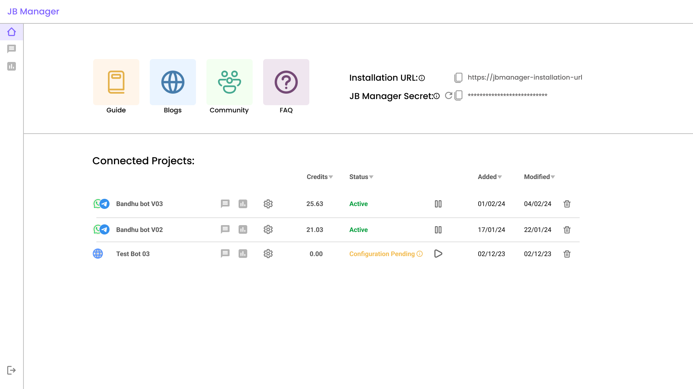

# Jugalbandi Manager

Jugalbandi (JB) Manager is a full AI-powered conversational chatbot platform. It's platform agnostic and can serve multiple channels such as WhatsApp or custom web interfaces. It can handle conversations in both text and voice across any language. It comes with Bhashini Speech models out of the box and can failover to Azure.

See [Quickstart Guide](https://opennyai.github.io/Jugalbandi-Manager/tutorials/quickstart.html)

Read the full documentation [here](https://docs.jugalbandi.opennyai.org/)
