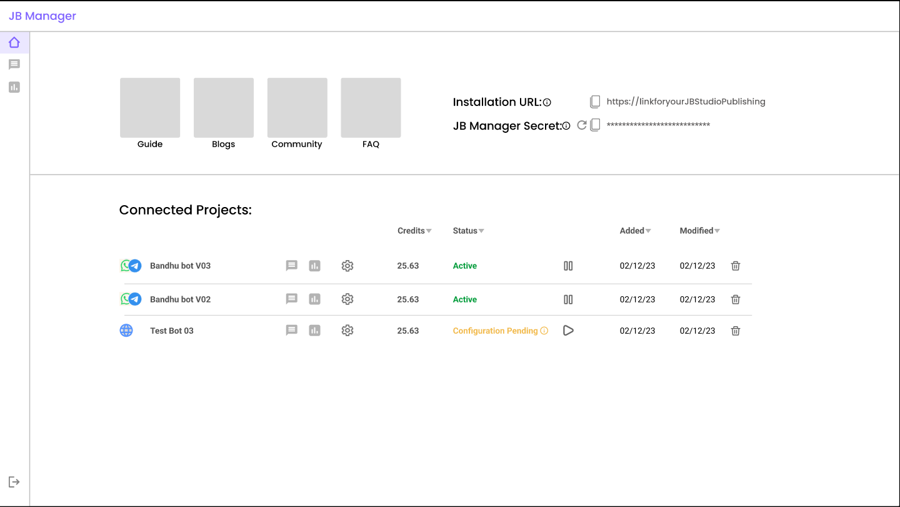

Note: This repository is rapidly evolving. While we try our best to avoid it, there could be some breaking changes.

# JB Manager
Jugalbandi v2 that supports both information and actions. Now an NGO, Government Department or Social Enterprise user can build with the Jugalbandi Studio and with one-click deploy their bot and make it available to their beneficiaries.

We have repackaged the code into an event-driven architecture to make it scalable and also composable to meet varying needs.

## Deep Dive
To deep dive into the architecture and various components, look [here](DeepDive.md)

## Developer Notes (moved)
Please look at the updated [Developer Notes](Developer.md).
