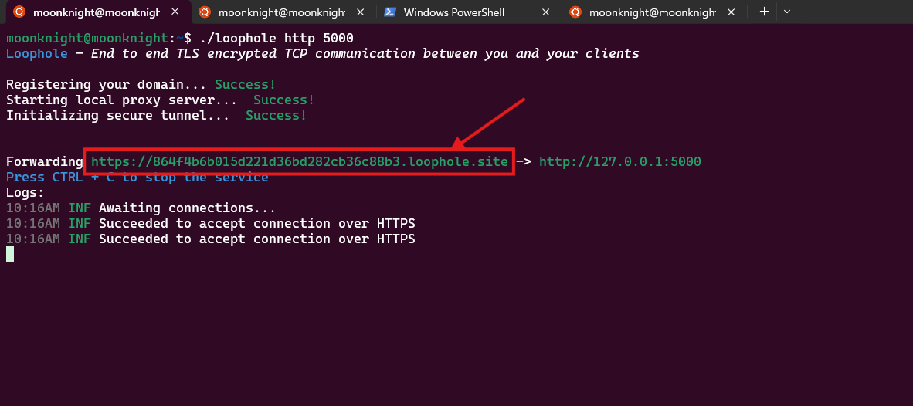
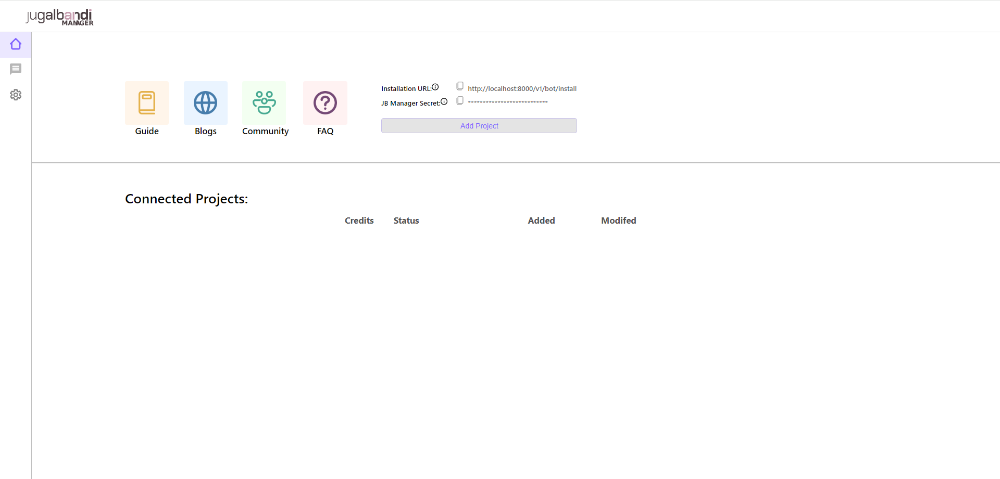
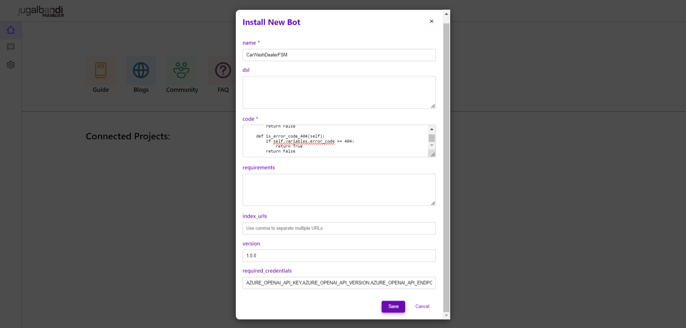
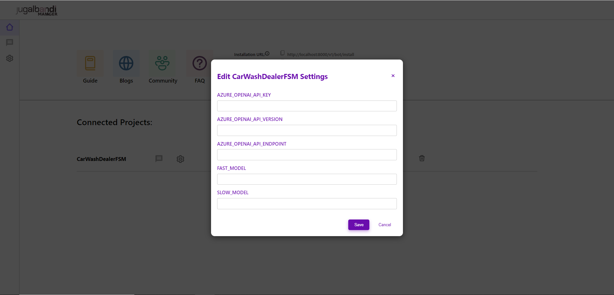
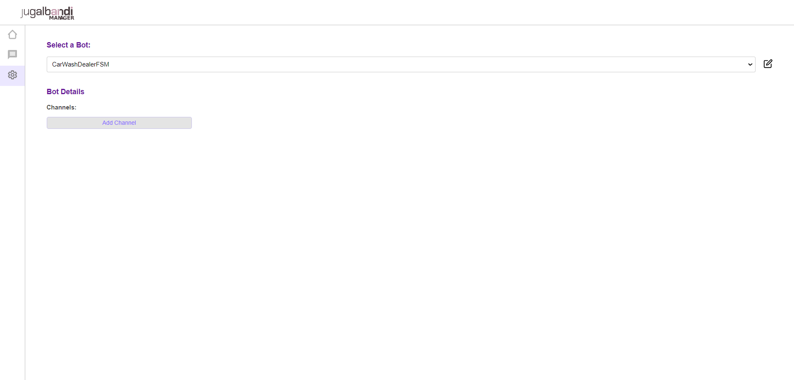
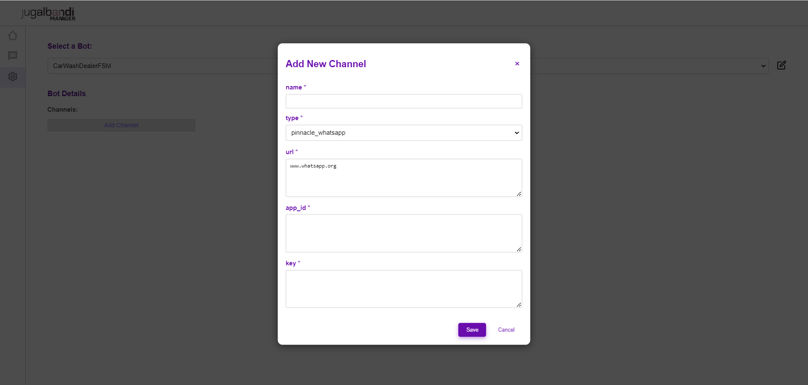
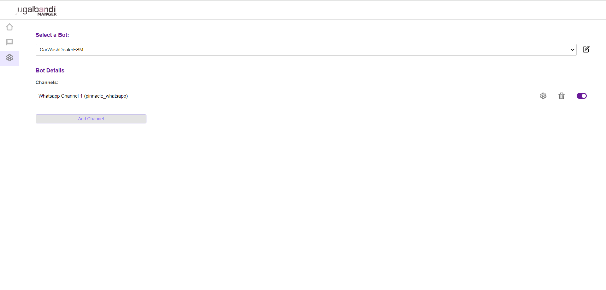
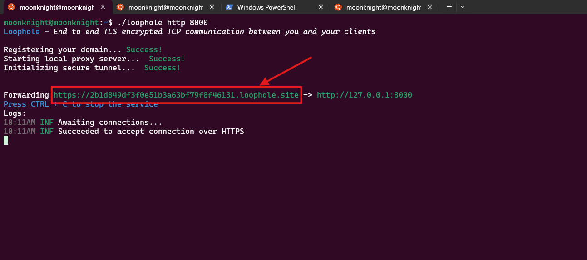

# Quickstart

This quickstart is designed for linux based systems such as Linux distros and Mac. If using windows, Use WSL terminal to follow the quickstart. For installation instruction, refer to [WSL Installation Guide](https://learn.microsoft.com/en-us/windows/wsl/install).

### Prerequisite

1. **Docker** - Ensure that your system has docker engine installed and running. For installation, please refer to [docker engine installation instruction](https://docs.docker.com/engine/install/).
   * The recommended way is to install docker desktop for your system. If using WSL with Windows, Enable docker for you WSL distro. Please refer to [docker desktop installation](https://learn.microsoft.com/en-us/windows/wsl/tutorials/wsl-containers#install-docker-desktop) for more details.
2. **Docker Compose** - Ensure docker compose is enabled along with docker engine. Please refer to [docker compose installation instruction](https://docs.docker.com/compose/install/).
3. **Tunnel** - Tunneling exposes your local system to the services on the web by tunneling the external calls to your local system. Either of these two popular services can be used:
   - **Loophole** - Please refer to the [Loophole Quickstart Guide](https://loophole.cloud/download/) for installation.
   - **Ngrok** - Please refer to the [Ngrok Quickstart Guide](https://ngrok.com/docs#getting-started) for installation.
4. **Translation and Speech API** - JBManager uses speech processing API to handle audio and translation API to handle user input in various languages. Please refer to Translation and Speech API [setup guide](../references/speech-and-translation.md) for more details.
5. **Whatsapp Interface** - This quickstart will focus on setup your own through whatsapp as channel. Please refer to [channel setup guide](../references/whatsapp.md) for more details.

### Running JB Manager

1. Clone and Change the directory to the project root.

```bash
$ git clone git@github.com:OpenNyAI/Jugalbandi-Manager.git
$ cd Jugalbandi-Manager
```

2. Copy the contents of `.env-dev.template` file to `.env-dev` in the same directory.

```bash
$ cp .env-dev.template .env-dev
```

3. Update the values of translation and speech fields in the `.env-dev` file.

```
# Bhasini Keys
BHASHINI_USER_ID=
BHASHINI_API_KEY=
BHASHINI_PIPELINE_ID=
# Azure Speech Keys
AZURE_SPEECH_KEY=
AZURE_SPEECH_REGION=
# Azure Translation Keys
AZURE_TRANSLATION_KEY=
AZURE_TRANSLATION_RESOURCE_LOCATION=
# Whatsapp API URL
WA_API_HOST=
```

4. Generate an Encryption key using the following command

```bash
$ dd if=/dev/urandom bs=32 count=1 2>/dev/null | openssl base64
```

and add it to `ENCRYPTION_KEY` in `.env-dev` file.

```
# Encryption key for storing credentials
ENCRYPTION_KEY=
```

Note: Remember to enclose value of `ENCRYPTION_KEY` within single quotes.

5. Create a folder `media` in the project root, and start a http server on port 5000 inside the `media` directory.

```bash
$ mkdir -p media
$ cd media
$ python3 -m http.server 5000
```

6. Start a new shell session and start tunnel for port 5000 on your system

   - For **Loophole**, use the following command:
     ```bash
     $ ./loophole http 5000
     ```

   - For **ngrok**, use the following command:
     ```bash
     $ ngrok http 5000
     ```

Copy the tunnel url from the shell (loophole example shown below) and add it to `PUBLIC_URL_PREFIX` in `.env-dev` file. 

```
PUBLIC_URL_PREFIX= # Set Tunnel URL if using local storage
```

7. Start Kafka and Postgres services using the following command.

```bash
$ bash scripts/run.sh kafka postgres
```

8. Start JB Manager

To start the JB Manager, you can use the following command with or without the `--stage` option:
- **With `--stage` option:**
    - When you use the `--stage` option, the script will leverage `docker-compose` in conjunction with `docker-compose.stage.yml` file which uses existing Docker images without rebuilding them, which will save time. This is useful for staging environments where you might want to use different configurations or services compared to the development environment. 
    ```bash
    $ bash scripts/run.sh --stage api channel language flow frontend
    ```

- **Without `--stage` option:**
  - When you do not use the `--stage` option, the script will build the Docker images from scratch and run `docker-compose` with the default `docker-compose.yml` file. This is typically used for development environments where you want to ensure that you are working with the latest code changes.
    ```bash
    $ bash scripts/run.sh api channel language flow frontend
    ```


9. Once the services are up and running, you can access the JB Manager UI at [http://localhost:4173](http://localhost:4173).

### Bot Installation and Go Live

1. Go to [JB Manager UI](http://localhost:4173) 
2. Click on Add Project and provide the required data to create your bot.  The detailed information about the fields are given below:
   1. **Name \[Mandatory]** is the name of the bot. It should be same as the name of class defined within below-mentioned bot code (fsm.py). For this example, use `CarWashDealerFSM`.
   2. **Code \[Mandatory]** is the fsm.py file python code. Copy the contents of [python file](../../../tutorials/car\_wash.py) and paste it.
   3. **version \[Mandatory]** - version of the bot. Put `1.0.0`.
   4. **required\_credentials \[Mandatory]** - Credentials required by the bot to access various external services. Enter the following: `AZURE_OPENAI_API_KEY,AZURE_OPENAI_API_VERSION,AZURE_OPENAI_API_ENDPOINT,FAST_MODEL,SLOW_MODEL` , so put these keys in this section seperated by comma.
   5. Click on `Save` button.
3. Once the bot is created, click on the **settings (⚙) icon** to enter the given credentials values and click save to save the credentials values. For this example, put the values of `AZURE_OPENAI_API_KEY`, `AZURE_OPENAI_API_VERSION`, `AZURE_OPENAI_API_ENDPOINT`, `FAST_MODEL` (typically, `gpt-3.5-turbo`) and `SLOW_MODEL` (typically, `gpt-4`). **Note: Remember to verify your model names. If you are using Azure OpenAI, this corresponds to Deployment Name and not model type** 
4. Then click on the **play (▶️) icon** to open the Channel Settings Page for the Bot, then click on Add Channel button 
5. Fill in the Channel details and click on save 
6. Toggle on the channel using the toggle switch at right hand side. This makes the channel active. To verify, go to home page by clicking `Home` icon on the left Navigation pane and you will see a `Pause` button next to the bot 
7. Start a new shell session and start tunnel for port 8000 on your system

   - For **Loophole**, use the following command:
     ```bash
     $ ./loophole http 8000
     ```

   - For **ngrok**, use the following command:
     ```bash
     $ ngrok http 8000
     ```

8. Copy the tunnel url from the shell (loophole example shown below). 
9. Add this url to register the callback URL for Whatsapp service provider. Your callback url will look like this `<Tunnel URL>/v2/callback/pinnacle_whatsapp/<Whatsapp business account number>`.

    For this tutorial, we are using the shell script to add the callback URL using Whatsapp API host. Run the script on a new shell session with the appropriate values to register the callback URL.

    ```bash
    #!/bin/bash

    WEBHOOK_URL="<Webhook url here>"
    WA_API_HOST="<API host here>"
    WABA_NUMBER="<Whatsapp business account number>"
    WA_API_KEY="<API Key here>"

    BODY='{"webhook_url": "'$WEBHOOK_URL'"}'
    echo $BODY
    curl -k "$WA_API_HOST/v1/setwebhooks" \
    --header "wanumber: $WABA_NUMBER" \
    --header "apikey: $WA_API_KEY" \
    --header 'Content-Type: application/json' \
    --data-raw "$BODY"
    ```
10. Your bot is running. Send a `Hi` message to whatsapp business number to start conversation with the bot.

### Quickstart FAQs 

1. #### Cannot install loophole on Apple Silicon-based Mac?
    Try setting up ngrok with a free tier subscription. Creating a single tunnel does not require any paid plan.
2. #### Which OpenAI Model to use?
    You can use any model just make sure it supports generating output in JSON mode.