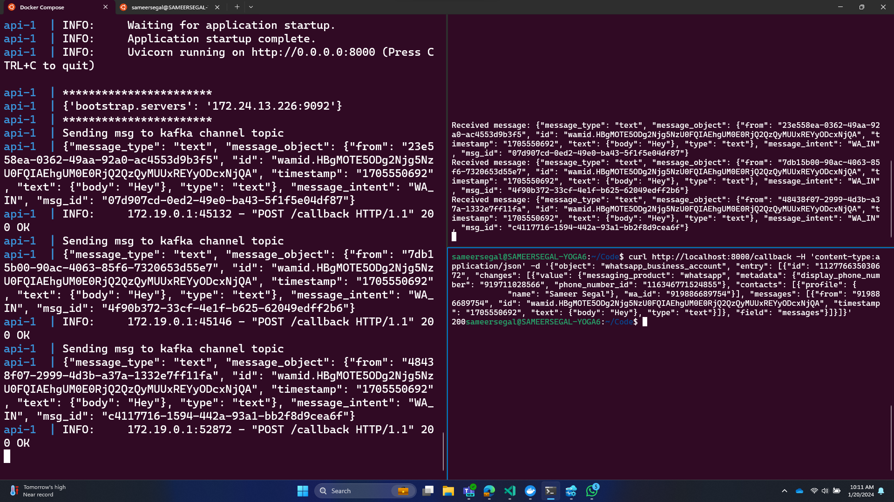

## Develop and Test Locally
The six services namely api, channel, language, flow, retriever and indexer functions independently and are communicated through the kafka queues.The below instructions are for the developer's reference to play around with each service individually.

1. Copy the contents of `.env-template` into a new file `.env-dev` and fill in the values.

2. In one terminal, start the `kafka` and `postgres` containers and keep them running.
```
  $ ./scripts/run.sh kafka postgres
```
3. In another terminal, set up the postgres tables.
```
  $ ./scripts/upgrade-db.sh
```
You can check the database if the tables are populated by using [DBeaver](https://dbeaver.io/)

4. Create the kafka topics.
```
  $ ./scripts/create-topic.sh language
  $ ./scripts/create-topic.sh channel
  $ ./scripts/create-topic.sh flow
  $ ./scripts/create-topic.sh rag
  $ ./scripts/create-topic.sh indexer
  $ ./scripts/create-topic.sh response
```
5. You can run one or more services by mentioning the required service names (space separated).
```
$ ./scripts/run.sh <one or more service names that you are testing>
# names of the services - api, channel, language, flow, retriever, indexer
```
6. To run and test each service separately:
   Each service has specific data contracts (Input / Output JSONs). Check out [Data Contracts](#data-contracts) section below. Follow the steps given below:
1. In one terminal, run a service (other than api)
    ```
    $ ./scripts/run.sh <service_name>
2. In another terminal, send the respective the JSON message to its kafka topic.
    ```
    $ ./scripts/send-message.sh <topic_name> <json>
       ```
3. Read the output message generated by the service
    ```
    $ ./scripts/read-message.sh <topic_name>





## Data Contracts
### 1. Flow, Language, Retriever

See the Pydantic models [lib/data_models.py](lib/data_models.py). Refer input classes of flow, language, retriever

### 2. API
    curl http://localhost:8000/callback -H 'content-type:application/json' -d '{"object": "whatsapp_business_account", "entry": [{"id": "112776635030672", "changes": [{"value": {"messaging_product": "whatsapp", "metadata": {"display_phone_number": "919711028566", "phone_number_id": "116346771524855"}, "contacts": [{"profile": {"name": "Test User"}, "wa_id": "919999999999"}], "messages": [{"from": "919999999999", "id": "wamid.HBgMOTE5ODg2Njg5NzU0FQIAEhgUM0E0RjQ2QzQyMUUxREYyODcxNjQA", "timestamp": "1705550692", "text": {"body": "Hey"}, "type": "text"}]}, "field": "messages"}]}]}'

### 3. Indexer
    '{"collection_name":"KB_Law_Files", "files":["combine.pdf", "Property Law.xlsx"]}'
**Note**: files are fetched from ./data directory


## Indexing the Knowledge Base

1. Indexing is a one time job. Once the knowledge base is indexed, data will be put into vector db.
  ```
   $ ./scripts/send-message.sh indexer {"collection_name":"KB_collection_name", "files":["file1.xlsx","file2.pdf"]}
   ```
2. Check if the embeddings are created in the db using DBeaver. You would see the collection added into table `langchain_pg_embedding`

3. Replace the `collection_name` in [flow/main.py](flow/main.py) with the above specified collection name for retrieval of the indexed knowledge base.


## Local DB Migrations
In order to make changes to the schema, update [lib/models/\_\_init__.py](lib/models/__init__.py)

```
$ ./scripts/create-migration.sh <description of the changes>
```

## Resetting Dev Environment

Often there are times when it's better to start from scratch.

```
# bring down whatever is running
$ docker compose down

# following will delete all your containers - be careful
$ docker volume ls | awk '{print $2}' | xargs docker volume rm

# if you don't want clutter, you can delete all containers
$ docker ps -a | awk '{print $1}' | xargs docker rm
```


