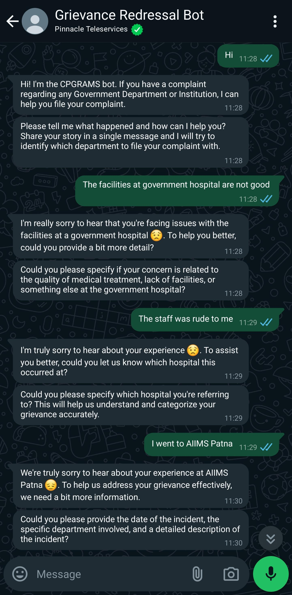
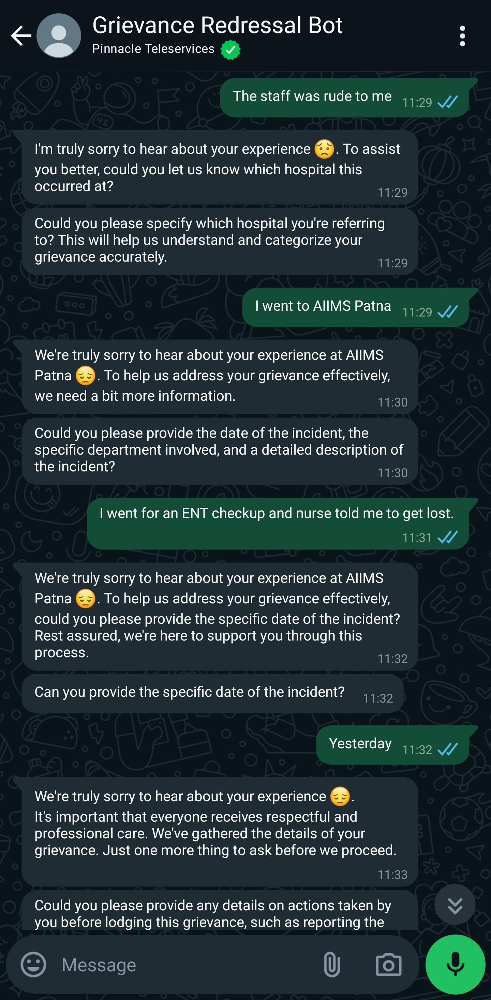
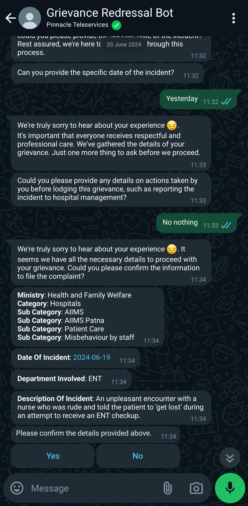
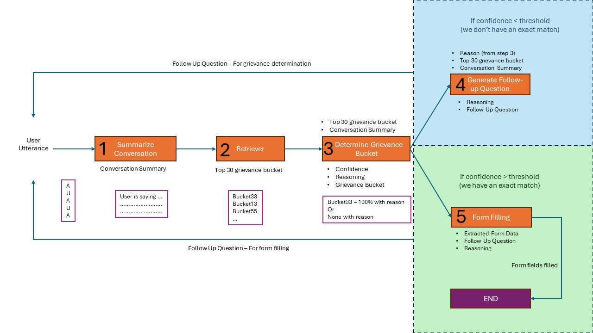

This is an example of building a grievance bot. We consider an organization like [CPGRAMS](https://pgportal.gov.in/) that allows Indian citizens to lodge complaints with any department of the government. 

Review the notbooks [indexer.ipynb](indexer.html) and [retriever.ipynb](retriever.html) in this directory for the entire source code.

# Final User experience

||||
|:-:|:-:|:-:|
||||


# Step 1: Data Indexing Pipeline

## Intial Data

We scrape the following information from the CPGRAMS website:

| Ministry                          | Category                                                                                | Subcategory 1                                     | Subcategory 2                                  | Subcategory 3           | Subcategory 4 | Subcategory 5    |
|-----------------------------------|-----------------------------------------------------------------------------------------|--------------------------------------------------|-----------------------------------------------|-------------------------|---------------|------------------|
| Department of Science and Technology | Removed/ Retrenched Employee/ Service Matter/ Transfer/ Compassionate Appointment/ other | SMP Division                                      | Survey of India                                | Chhattishgarh GDC Raipur |               |                  |
| Department of Science and Technology | Allegation of Harassment/ Atrocities                                                   | Cash ACR Library                                  |                                               |                         |               |                  |
| Housing and Urban Affairs         | NBCC                                                                                    | NBCC                                              | Regarding Contract/ Tax/ Bill Payment/ Project | INDIA                   | Madhya Pradesh |                  |
| Ministry of Panchayati Raj        | Corruption Related to Panchayats                                                        | Panchayat Embezzlement or Misappropriation of Funds | Madhya Pradesh                                |                         |               |                  |
| Telecommunications                | Employee Related / Services Related                                                     | Pending any type of Bill/dues for payment         |                                               |                         |               |                  |
| Housing and Urban Affairs         | NBCC                                                                                    | NBCC                                              | Regarding Contract/ Tax/ Bill Payment/ Project | INDIA                   | Delhi         | East Kidwai Nagar |
| Department of Ex Servicemen Welfare | Service Related                                                                        | Outstanding Dues                                  | Monetary Allowance for Gallantry Awards        | Navy                    |               |                  |
| NITI Aayog                        | Administration and Establishment Matters                                                | Recruitment                                       | Young Professionals and Consultants            | Declaration of Result   |               |                  |
| Housing and Urban Affairs         | NBO (National Buildings Organisation)                                                   | Various Service Matters                           | Service                                       |                         |               |                  |
| Housing and Urban Affairs         | Directorate of Estates                                                                  | Allotment Related-Delhi                           | Type-I & II                                   | Waiting List            |               |                  |


## Data Augmentation
We have generated an elaborate description for each grievance by using GPT-4, with appropriate system prompt and providing the ministry name, category and subcategories. The generated description is in following format:

| Ministry           | Category                           | Subcategory 1                             | Description                                                                                                                                                                                                                                                    |
|--------------------|------------------------------------|-------------------------------------------|----------------------------------------------------------------------------------------------------------------------------------------------------------------------------------------------------------------------------------------------------------------|
| Telecommunications | Employee Related / Services Related | Pending any type of Bill/dues for payment | This grievance category pertains to issues related to pending bills or dues for payment in the telecommunications sector, specifically in relation to employees or services. <br>Individuals may file complaints if they have not received bills for their telecommunications services, if there are errors or discrepancies in the billing, if they are facing challenges in making payments for their bills, or if there are delays in the processing of payments resulting in overdue dues. <br> Some common examples of how people may refer to this grievance include:<br>- Unpaid bills for telecommunications services<br>- Overdue payments for phone/internet services<br>- Outstanding dues for mobile network usage<br>- Pending invoices for employee phone plans<br>It is important for the Department/Ministry of Telecommunications to address these grievances promptly in order to ensure smooth operation of services and fair treatment of employees. |


## Schema for Vector DB

We need to make this available in a VectorDB to fetch the data based on similarity. We create the following schema. `embedding` is the vector representation of `description` column.
```
class GrievanceCategory(Base):
    __tablename__ = "grievance_category"
    id = Column(String, primary_key=True)
    ministry = Column(String)
    category = Column(String)
    subcategory = Column(ARRAY(String))
    description = Column(String)
    embedding = mapped_column(Vector(1536))
    fields = Column(ARRAY(JSON))
```

`fields` stores an array of fields that the user needs to provide to lodge their compliant.

## Data Indexing

# Step 2: Data Retriever Pipeline



## Summarizing details provided so far

## Fetching matching records from VectorDB

## Ask clarifying question or are we done?

## Asking for details required to lodge the complaint.


